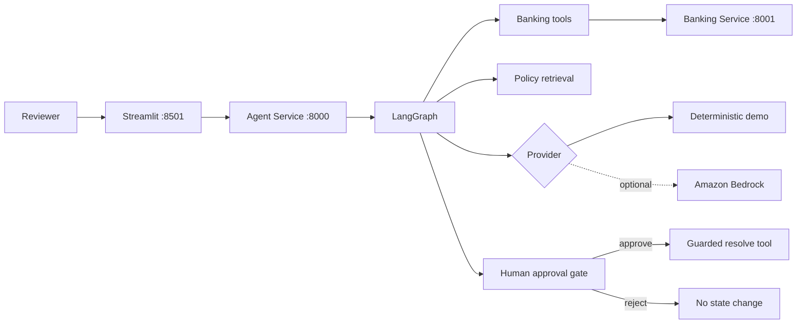
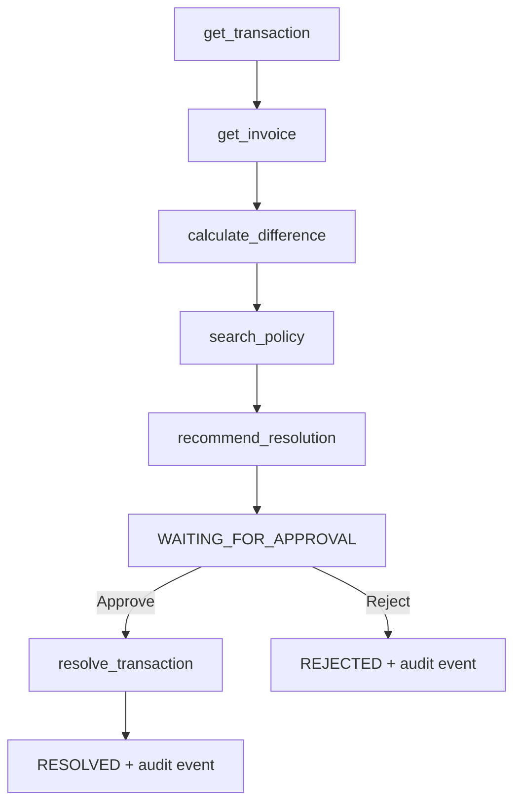

# Agentic Bank Reconciliation

> Agentic AI system for investigating banking reconciliation exceptions using tool calling, policy retrieval, human-in-the-loop approval, Docker, Kubernetes, and AWS-ready deployment.

[](https://github.com/abdelrahmansaeed291/agentic-bank-reconciliation/actions/workflows/ci.yml)

This interview-ready project shows how an AI agent can investigate a payment exception, gather evidence through tools, apply a reconciliation policy, explain its conclusion, and recommend an action—without making an unauthorized financial change. It runs fully offline in deterministic demo mode and requires no API key.

**All banking records, companies, transactions, and invoices in this repository are synthetic.**

## Overview

The system contains three small services:

- **Banking service:** a FastAPI mock system of record for synthetic transactions and invoices.
- **Agent service:** a FastAPI and LangGraph workflow for investigation, retrieval, recommendations, approvals, and audit history.
- **Frontend:** a Streamlit review console showing evidence, tool trace, decision controls, status, and audit events.

Try `TX1003`: the bank received EUR 980 for an invoice expecting EUR 1,000. The agent calculates a EUR 20 difference, retrieves the minor-discrepancy rule, recommends an action, and pauses at `WAITING_FOR_APPROVAL`.

## Business problem

Finance teams reconcile bank transactions against accounting invoices. Exact matching is routine, but missing references, small underpayments, currency mismatches, and unknown invoices require evidence gathering and judgment. Manual investigation is slow; opaque automation is risky.

This project separates read-only investigation from write execution. The agent accelerates evidence collection while a human retains authority over the final banking action.

## Why agentic AI?

A fixed rule can compare two amounts. An agentic workflow becomes useful when it must choose and sequence multiple capabilities: retrieve a transaction, follow its invoice reference, calculate a discrepancy, locate relevant policy, synthesize a recommendation, and preserve a trace. LangGraph makes those steps explicit and inspectable instead of hiding them in one prompt.

## Architecture



Detailed design and trust boundaries are in [docs/architecture.md](docs/architecture.md).

## Agent workflow



The case state carries the transaction, invoice, calculated difference, cited policy sections, recommendation, approval/final status, and ordered tool trace.

## Human-in-the-loop safety

Investigation never calls the write tool. The graph ends after producing a recommendation, and every recommendation sets `requires_approval=true`. A separate approval command sends an `APPROVED` assertion to the banking service; the banking service itself rejects unapproved or unsupported resolution requests. Rejection produces an audit event but never touches the transaction.

This is defense in depth for a demo, not a substitute for production authentication, RBAC, signed authorization, segregation of duties, and durable audit storage.

## Technology stack

- Python 3.12 target
- FastAPI, Pydantic, httpx, Uvicorn
- LangGraph
- Streamlit
- Lightweight local Markdown retrieval
- pytest and pytest-asyncio
- Docker Compose
- Kubernetes manifests for kind/k3s
- Optional Amazon Bedrock provider via boto3

The retrieval implementation intentionally uses transparent token-overlap ranking. It is fast, offline, and easy to explain. FAISS/sentence-transformers can be introduced behind the `PolicyRetriever` interface when the policy corpus becomes large enough to justify embeddings.

## Project structure

```text
agentic-bank-reconciliation/
├── agent-service/       # LangGraph, tools, providers, cases, audit API, tests
├── banking-service/     # Synthetic bank/invoice API and guarded write, tests
├── frontend/            # Streamlit reviewer experience
├── policies/            # Retrieved reconciliation policy
├── kubernetes/          # Namespace, ConfigMap, Deployments, Services
├── scripts/             # Local PowerShell launcher
├── docs/                # Architecture and AWS deployment path
├── .github/workflows/   # CI
├── docker-compose.yml
└── .env.example
```

## Local setup

Prerequisites: Python 3.12+ and Git. From the repository root on Windows PowerShell:

```powershell
python -m venv .venv
.\.venv\Scripts\Activate.ps1
python -m pip install -r banking-service\requirements.txt -r agent-service\requirements.txt -r frontend\requirements.txt
```

Start each component in a separate terminal:

```powershell
cd banking-service
..\.venv\Scripts\python.exe -m uvicorn app.main:app --port 8001
```

```powershell
cd agent-service
..\.venv\Scripts\python.exe -m uvicorn app.main:app --port 8000
```

```powershell
cd frontend
..\.venv\Scripts\streamlit.exe run app.py --server.port 8501
```

Or use `powershell -ExecutionPolicy Bypass -File scripts/run-local.ps1`. Open <http://localhost:8501>. API documentation is available at <http://localhost:8000/docs> and <http://localhost:8001/docs>.

## Run without LLM/API keys

No configuration is necessary. `LLM_PROVIDER=demo` is the default. The deterministic provider exercises the same LangGraph tools, retrieval, recommendation, approval, and audit flow without internet access or model credentials.

Optional Bedrock mode:

```powershell
python -m pip install -r agent-service\requirements-bedrock.txt
$env:LLM_PROVIDER = "bedrock"
$env:AWS_REGION = "eu-central-1"
$env:BEDROCK_MODEL_ID = "your-enabled-model-id"
```

Use an AWS profile or IAM role. Never put credentials in this repository or `.env` files.

For a Bedrock-enabled container build, set `INSTALL_BEDROCK=true` before running Docker Compose, or pass `--build-arg INSTALL_BEDROCK=true` when building the agent image directly.

## Docker setup

With Docker Desktop or Docker Engine + Compose installed:

```bash
docker compose up --build
```

Open <http://localhost:8501>. Compose injects `http://agent-service:8000` and `http://banking-service:8001` for internal traffic; it does not rely on container-local `localhost`.

## Kubernetes setup

Build the three images using the names in the manifests:

```bash
docker build -t agentic-bank-reconciliation/banking-service:latest ./banking-service
docker build -t agentic-bank-reconciliation/agent-service:latest -f agent-service/Dockerfile .
docker build -t agentic-bank-reconciliation/frontend:latest ./frontend
```

Create the local cluster with the pinned Kubernetes image. The custom config
allows extra startup time on Docker Desktop and maps the frontend NodePort:

```bash
kind create cluster --name bank-reconciliation --config kind-config.yaml --image kindest/node:v1.34.3@sha256:08497ee19eace7b4b5348db5c6a1591d7752b164530a36f855cb0f2bdcbadd48 --wait 7m
kind load docker-image agentic-bank-reconciliation/banking-service:latest agentic-bank-reconciliation/agent-service:latest agentic-bank-reconciliation/frontend:latest --name bank-reconciliation
kubectl apply -f kubernetes/
kubectl wait --for=condition=available deployment --all -n bank-reconciliation --timeout=5m
kubectl get pods -n bank-reconciliation
```

Open <http://localhost:30080>. The frontend Service uses NodePort `30080`,
which `kind-config.yaml` maps to the same host port.

## AWS architecture

The low-cost future target is one EC2 instance running k3s, private ECR repositories for images, and optional Bedrock inference through an instance IAM role. EKS is deliberately excluded. See [docs/aws-deployment.md](docs/aws-deployment.md) for the deployment sequence and security notes.

## Demo scenarios

| ID | Synthetic scenario | Expected recommendation |
|---|---|---|
| TX1001 | Exact match | Mark reconciled |
| TX1002 | Exact match | Mark reconciled |
| TX1003 | EUR 1,000 expected; EUR 980 received | Accept minor discrepancy |
| TX1004 | Missing payment reference | Manual reference review |
| TX1005 | USD payment for EUR invoice | Currency/FX investigation |
| TX1006 | Unknown invoice reference | Unknown invoice investigation |

Every scenario still waits for a human decision—even exact matches.

## Testing

Run each service suite from the repository root:

```powershell
Push-Location banking-service; ..\.venv\Scripts\python.exe -m pytest -q; Pop-Location
Push-Location agent-service; ..\.venv\Scripts\python.exe -m pytest -q; Pop-Location
```

The tests cover the banking API guard, synthetic data, policy retrieval, tool order, approval execution, rejection behavior, and audit events. GitHub Actions repeats both suites on Python 3.12.

## Interview talking points

- **Why a graph?** It exposes orchestration, state, and tool order while keeping each node independently understandable.
- **Why deterministic demo mode?** Interviews should not fail because of Wi-Fi, quota, model access, or credentials.
- **Where is the safety boundary?** The investigation graph cannot write. Approval is a separate command, and the downstream service validates it again.
- **Is this really RAG?** Yes: relevant policy chunks are retrieved at runtime and supplied as evidence. The small corpus favors explainable lexical retrieval over a heavyweight vector stack.
- **What would change for production?** Durable workflow/case storage, identity and RBAC, idempotency keys, signed approvals, real integration adapters, encryption, observability, evaluation datasets, and formal compliance controls.

## Future improvements

- Persist cases and immutable audit events in a transactional database.
- Add enterprise identity, role-based approval, and dual-control workflows.
- Introduce idempotency and optimistic locking around execution.
- Add embedding retrieval and reranking for a larger policy library.
- Evaluate recommendation quality against a labeled exception dataset.
- Add OpenTelemetry traces and operational dashboards.
- Add authenticated ingress and managed TLS for deployment.

## License

MIT. See [LICENSE](LICENSE).
