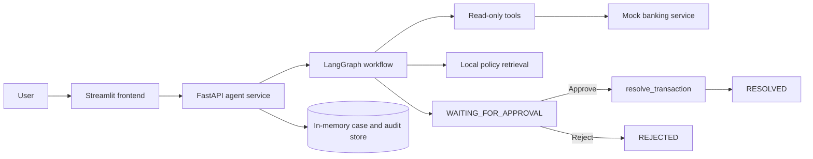
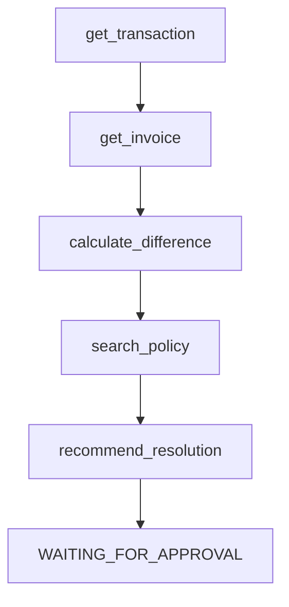

# Architecture

## Design goals

The project optimizes for interview clarity: every boundary is visible, demo mode is offline and deterministic, and financial writes are isolated behind explicit approval. It is deliberately a small three-service system rather than an enterprise platform.

## Responsibilities

- **Banking service:** owns synthetic transactions/invoices and the guarded state-changing endpoint.
- **Agent service:** coordinates tools, policy retrieval, recommendations, approval state, and audit history.
- **Frontend:** presents evidence and collects the human decision; it contains no reconciliation rules.
- **Policy retriever:** parses Markdown sections and ranks them by transparent token overlap. This keeps offline demo behavior fast and explainable. An embedding retriever can replace it behind the same boundary later.
- **Recommendation provider:** deterministic demo provider by default; optional Amazon Bedrock provider for natural-language explanations.

## LangGraph flow

Each node adds an entry to `tool_trace`. The graph ends after recommendation. Approval is a separate API command, which makes the safety boundary straightforward to test and explain.

## Trust boundaries and limitations

This demonstration has no authentication and uses in-memory state, so it is not production-ready. In a real bank, identity/RBAC, a durable database, idempotency controls, signed approval claims, encryption, observability, and segregation-of-duties controls would be required. No real customer data is used here.
